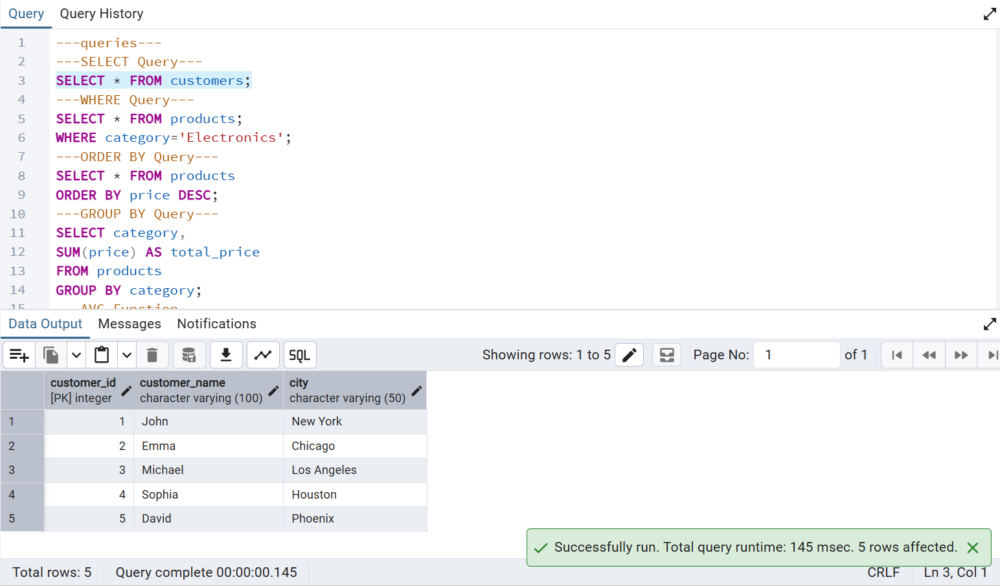
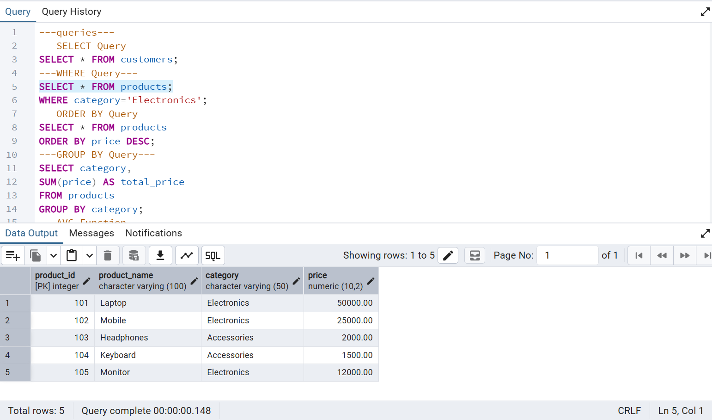
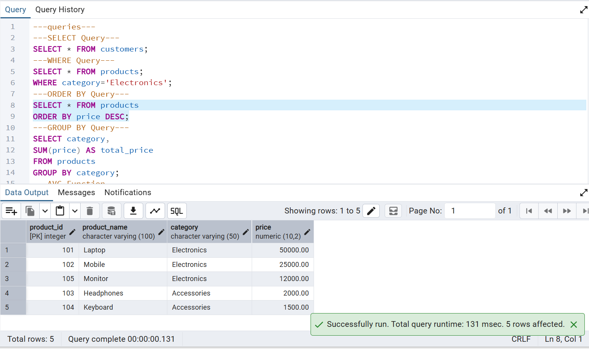
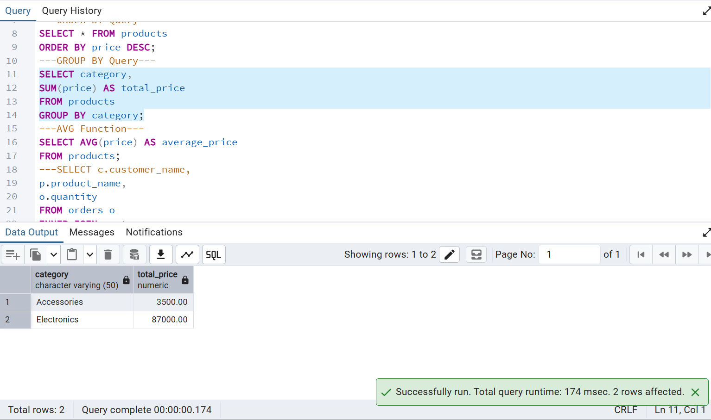
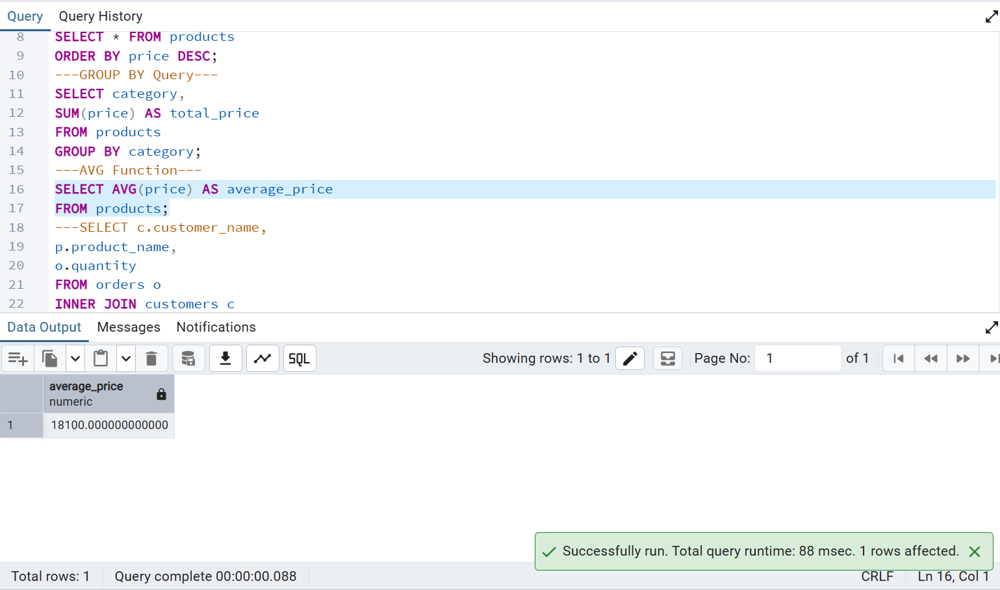
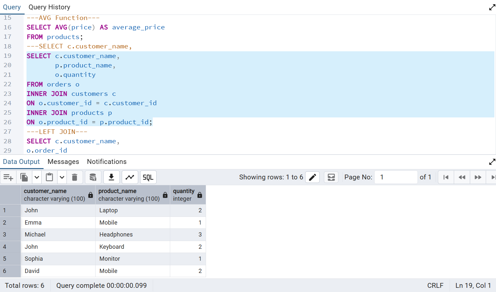
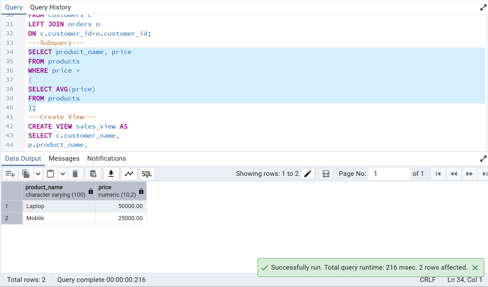
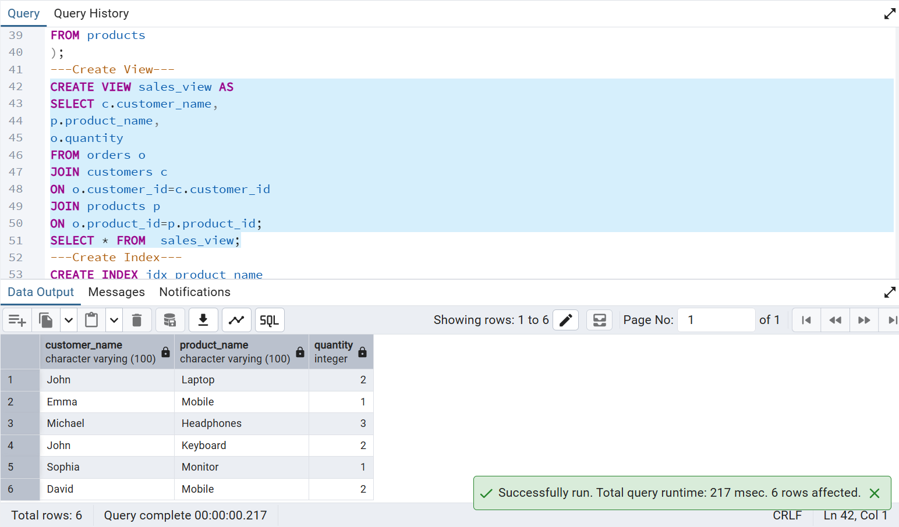
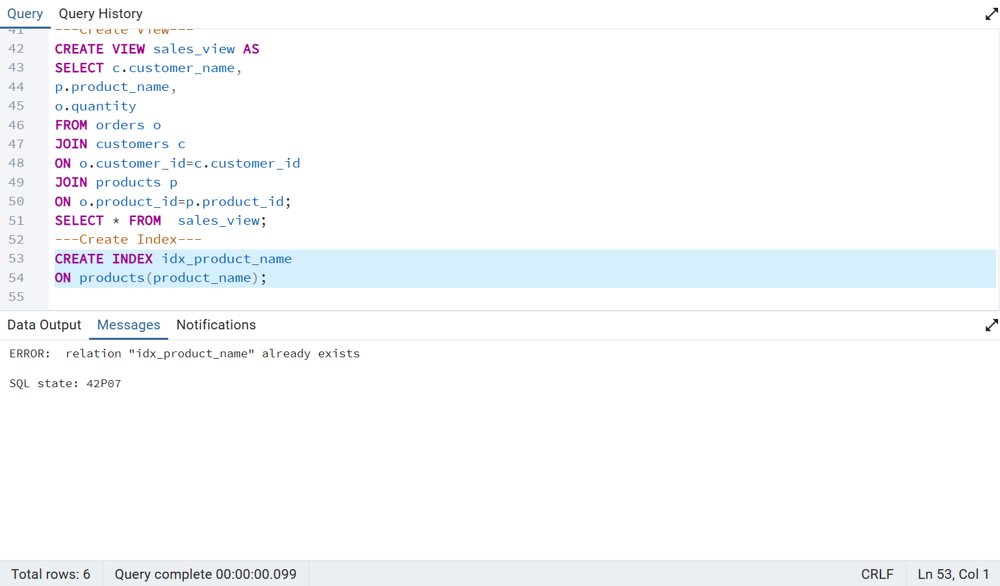

# Task 4 - SQL for Data Analysis

## Internship
Data Analyst Internship – DataX Labs

## Objective
Use SQL queries to extract and analyze data from a database using PostgreSQL.

## Tools Used
- PostgreSQL
- pgAdmin 4
- GitHub

## Dataset
E-commerce Database

## SQL Concepts Implemented
- SELECT
- WHERE
- ORDER BY
- GROUP BY
- Aggregate Functions (SUM, AVG)
- INNER JOIN
- LEFT JOIN
- Subqueries
- Views
- Indexes

## Files Included
- create_data.sql
- insert_data.sql
- queries.sql
- Output Screenshots

---

## Query Outputs

### SELECT Query

### WHERE Query

### ORDER BY Query

### GROUP BY Query

### AVG Function

### INNER JOIN

### LEFT JOIN

### Subquery

### View Creation and Output

### Index Creation

---

## Key Learnings
- Retrieved and filtered data using SQL queries.
- Performed data aggregation using SUM and AVG functions.
- Combined data from multiple tables using JOINs.
- Used subqueries for advanced filtering.
- Created Views for simplified analysis.
- Improved query performance using Indexes.

## Outcome
Successfully completed SQL-based data analysis by applying essential SQL concepts and database operations on an E-commerce dataset.

## Author
Kapa Sri Lakshmi
